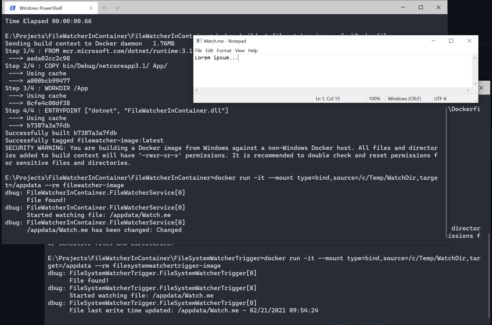

# System.IO.FileSystemWatcher in a container

## The problem

The [FileSystemWatcher](https://docs.microsoft.com/dotnet/api/system.io.filesystemwatcher) acts differently on systems when the file is in a shared directory of a container.

It works:

- When the file modified in the container.
- When the file modified from another container.
- When the hosting operating system is MacOS os Linux and the file modified from the host.

It doesn't work:

- When Windows is the hosting operating system and the file modified from the host.

## Repo content

This repo contains a solution with two different .Net Core 3.1 project. 

- The FileWatcherInContainer uses the FileSystemWatcher class to watch for changes on the file.
- The FileSystemWatcherTrigger checks the LastWriteTime periodically to detect when the file changed and modifies it again, so when it runs in a container it will trigger the FileSystemWatcher events. This is just for experimenting and not for using it in productive implementations.

## Prerequisites

To run the projects from this repo, you need the following:

- Docker on your computer
- .Net Core 3.1 SDK

If you want to modify the file in the shared folder in you can do it by manually start a container with the same shared directory, attach to its shell and just modify it using touch, echo or anything. If you prefer to use VSCode, you can use Remote Containers to start a container with the shared folder and modify the file.

## Usage

To start the examples, both project contains a run_in_container script for windows and for MacOS. These scripts build the projects, build the image and run the container attached to the shell. The projects read from the console, that is why it needs to be attached.

When you modify the file you can see if it picks up in the containers output.

